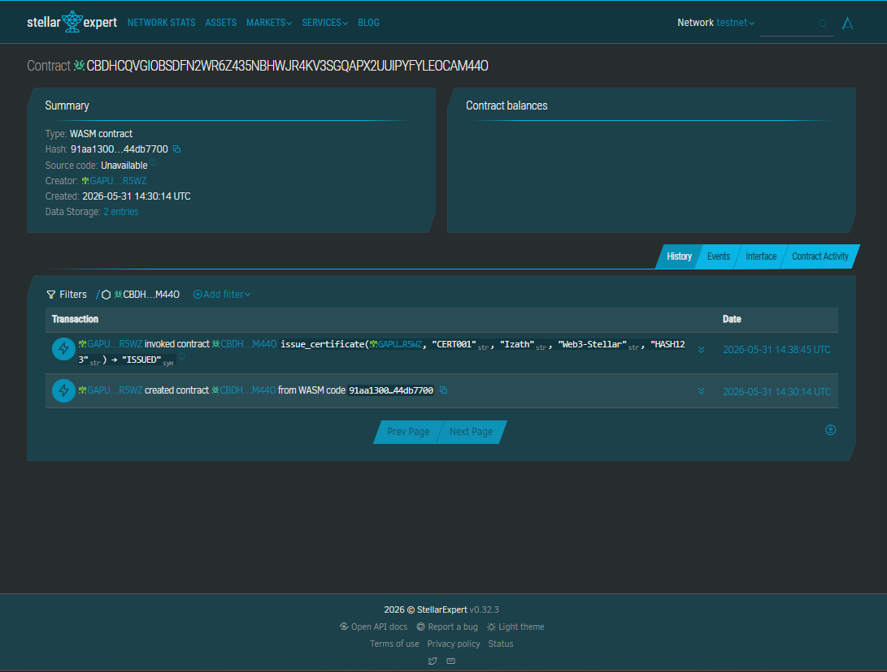
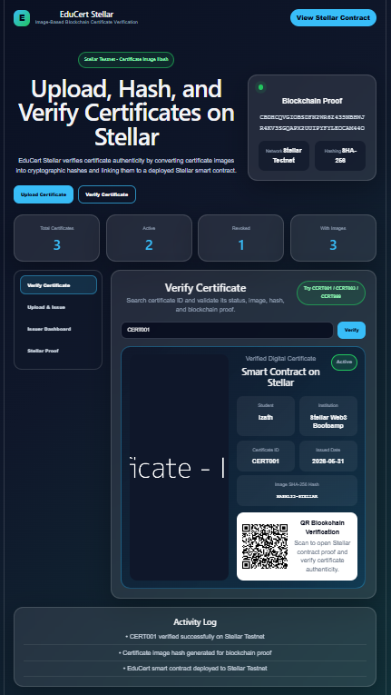
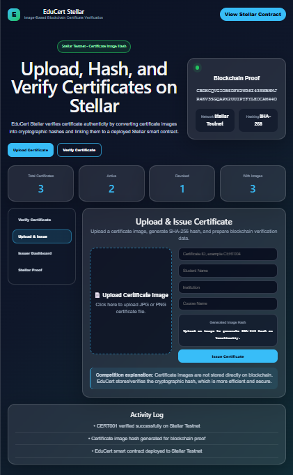
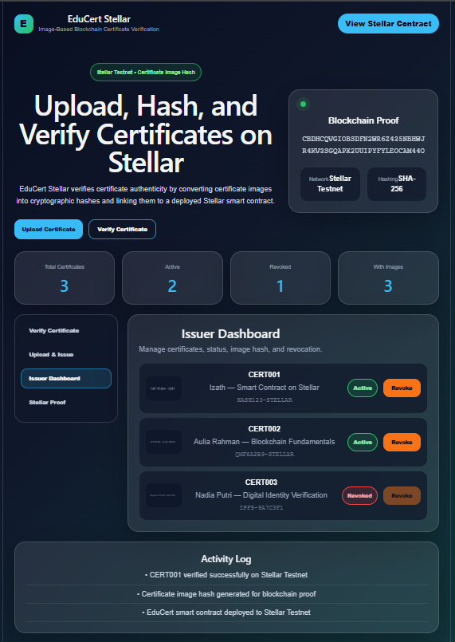

# EduCert Stellar 

Blockchain-Based Certificate Verification Platform built on Stellar Soroban Smart Contracts.

## Overview

EduCert Stellar is a decentralized certificate verification platform that helps educational institutions issue, verify, and revoke digital certificates securely using Stellar smart contracts.

This project aims to reduce fake certificates by providing immutable blockchain verification, QR-based validation, and transparent certificate status tracking.

---

## Features

* Certificate Verification
* Blockchain-Based Certificate Storage
* QR Code Verification
* Revoked Certificate Detection
* Issuer Dashboard
* Stellar Testnet Smart Contract
* Modern Web3 Frontend
* Activity Log Monitoring

---

## Built With

### Frontend

* React.js
* Vite
* CSS3
* QRCode React

### Blockchain

* Stellar Soroban Smart Contract
* Rust
* Stellar CLI

---

## Smart Contract Information

### Contract ID

```text
CBDHCQVGIOBSDFN2WR6Z435NBHWJR4KV3SGQAPX2UUIPYFYLEOCAM44O
```

### Issuer Address

```text
GAPUGHPKCGJWLKPQLQDINC5BEP3MASLNVIRHEZDVSDOBFWRWSY7WR5WZ
```

### Network

```text
Stellar Testnet
```

## Stellar Testnet Deployment

### Stellar Explorer



### Explorer Link

```text
https://stellar.expert/explorer/testnet/contract/CBDHCQVGIOBSDFN2WR6Z435NBHWJR4KV3SGQAPX2UUIPYFYLEOCAM44O
```

---

## Frontend Preview

## Verify Certificate



## Upload & Issue Certificate



## Issuer Dashboard



## Stellar Blockchain Proof


---

## Smart Contract Functions

### issue_certificate

Used to issue a new certificate.

### verify_certificate

Used to verify whether a certificate is valid.

### revoke_certificate

Used to revoke invalid or fraudulent certificates.

---

## Demo Certificate IDs

| Certificate ID | Status  |
| -------------- | ------- |
| CERT001        | Active  |
| CERT002        | Active  |
| CERT003        | Revoked |

---

## Installation

### Clone Repository

```bash
git clone https://github.com/izath-phb/educert-stellar-verification.git
```

### Frontend Setup

```bash
cd frontend
npm install
npm run dev
```

---

## Smart Contract Deployment

### Build Contract

```bash
stellar contract build
```

### Deploy Contract

```bash
stellar contract deploy --wasm target/wasm32v1-none/release/hello_world.wasm --source alice --network testnet
```

---

## Problem Statement

Fake certificates and unverifiable credentials are becoming major issues in digital education systems.

EduCert Stellar provides a decentralized and transparent verification mechanism using blockchain technology to ensure authenticity and integrity of certificates.

---

## Future Improvements

* Wallet Authentication
* IPFS Integration
* NFT Certificate Minting
* Multi-Institution Verification
* Mainnet Deployment
* Real-Time Blockchain Sync

---

## Developer

Izath 

---

## License

This project is developed for educational and Stellar Web3 competition purposes.
